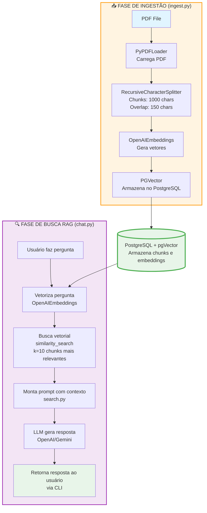

# Arquitetura do Sistema - Ingestão e Busca Semântica

## Visão Geral

Sistema de busca semântica (RAG - Retrieval Augmented Generation) que permite consultar documentos PDF através de perguntas em linguagem natural, utilizando LangChain, PostgreSQL com pgVector e modelos de IA.

## Arquitetura de Alto Nível



## Componentes Principais

### 1. Módulo de Ingestão (`src/ingest.py`)

**Responsabilidades:**
- Carregar arquivo PDF usando `PyPDFLoader`
- Dividir texto em chunks de 1000 caracteres com overlap de 150
- Gerar embeddings para cada chunk
- Armazenar chunks e embeddings no PostgreSQL com pgVector

**Fluxo:**
1. Carrega PDF → Extrai texto
2. Divide em chunks → Lista de documentos
3. Gera embeddings → Vetores numéricos
4. Armazena no banco → Chunks + embeddings

### 2. Módulo de Busca (`src/search.py`)

**Responsabilidades:**
- Definir template de prompt para RAG
- Realizar busca vetorial por similaridade
- Montar contexto para o LLM

**Fluxo:**
1. Recebe pergunta do usuário
2. Vetoriza pergunta
3. Busca k=10 chunks mais similares
4. Monta prompt com contexto
5. Retorna prompt pronto para LLM

### 3. Módulo de Chat (`src/chat.py`)

**Responsabilidades:**
- Interface CLI para interação com usuário
- Orquestrar busca e geração de resposta
- Exibir resposta formatada

**Fluxo:**
1. Loop de interação com usuário
2. Chama `search_prompt()` para buscar contexto
3. Envia prompt para LLM
4. Exibe resposta formatada

### 4. Banco de Dados (PostgreSQL + pgVector)

**Estrutura:**
- Tabela criada automaticamente pelo LangChain
- Armazena:
  - Texto original do chunk
  - Embedding vetorial
  - Metadados (opcional)

**Extensão pgVector:**
- Permite busca por similaridade vetorial
- Usa distância cosseno para comparação
- Índices otimizados para busca rápida

## Fluxo de Dados

### Fase de Ingestão

```
PDF → Texto → Chunks → Embeddings → PostgreSQL
```

### Fase de Consulta (RAG)

```
Pergunta → Embedding → Busca Vetorial → Chunks Relevantes → 
Prompt + Contexto → LLM → Resposta
```

## Tecnologias e Dependências

### Stack Principal
- **Python 3.9+**: Linguagem de programação
- **LangChain**: Framework para aplicações LLM
- **PostgreSQL 17**: Banco de dados relacional
- **pgVector**: Extensão para busca vetorial
- **Docker**: Containerização do banco de dados

### Bibliotecas Específicas
- `langchain_community.document_loaders.PyPDFLoader`: Carregamento de PDF
- `langchain_text_splitters.RecursiveCharacterTextSplitter`: Divisão de texto
- `langchain_openai.OpenAIEmbeddings`: Geração de embeddings (OpenAI)
- `langchain_google_genai.GoogleGenerativeAIEmbeddings`: Geração de embeddings (Gemini)
- `langchain_postgres.PGVector`: Integração com PostgreSQL vetorial
- `langchain_openai.ChatOpenAI`: Modelo LLM (OpenAI)
- `langchain_google_genai.ChatGoogleGenerativeAI`: Modelo LLM (Gemini)

## Decisões Arquiteturais

### 1. Chunking Strategy
- **Tamanho**: 1000 caracteres
- **Overlap**: 150 caracteres
- **Justificativa**: 
  - 1000 chars é um bom equilíbrio entre contexto e precisão
  - Overlap garante que informações não sejam perdidas nas bordas

### 2. Número de Chunks (k=10)
- **Justificativa**: 
  - 10 chunks fornecem contexto suficiente
  - Não sobrecarrega o prompt do LLM
  - Balance entre precisão e custo

### 3. PostgreSQL + pgVector
- **Justificativa**:
  - Solução open-source robusta
  - Integração nativa com LangChain
  - Suporte a busca vetorial eficiente
  - Persistência de dados

### 4. CLI em vez de API
- **Justificativa**:
  - Simplicidade para MVP
  - Foco em funcionalidade core
  - Facilita testes e desenvolvimento

## Considerações de Performance

- **Ingestão**: Processamento único, pode ser lento
- **Busca**: Otimizada com índices vetoriais do pgVector
- **LLM**: Latência depende do provedor (OpenAI/Gemini)
- **Custo**: Principalmente na geração de embeddings e chamadas LLM

## Segurança

- **API Keys**: Armazenadas em variáveis de ambiente (.env)
- **Dados**: PDFs e embeddings armazenados localmente
- **Banco de Dados**: Configurado para desenvolvimento (não produção)

## Limitações Conhecidas

- Busca limitada ao conteúdo do PDF ingerido
- Não há persistência de histórico de conversas
- CLI simples, sem recursos avançados de UI
- Processamento de PDFs grandes pode ser lento

